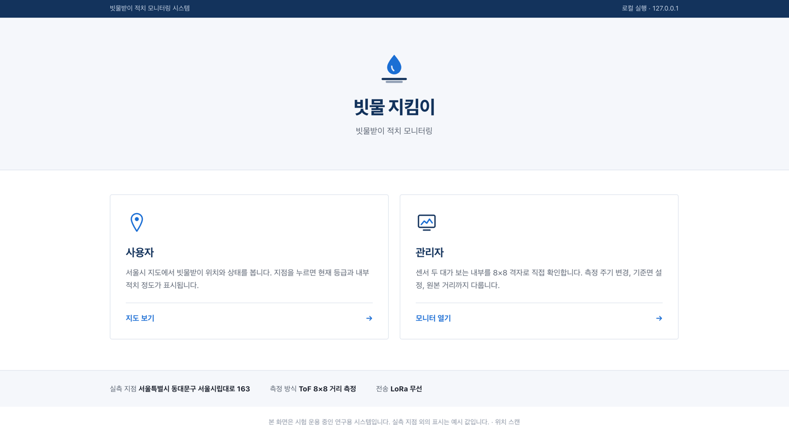
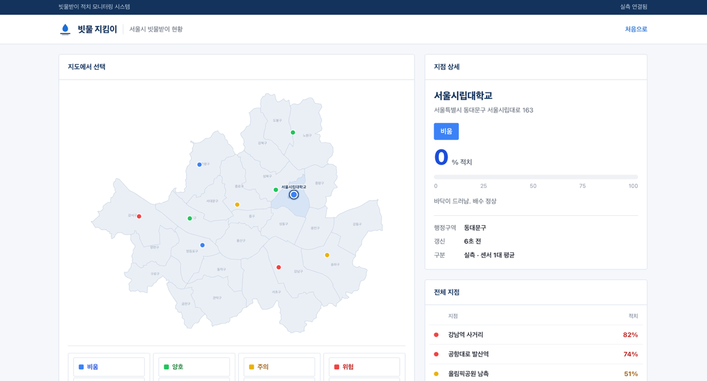
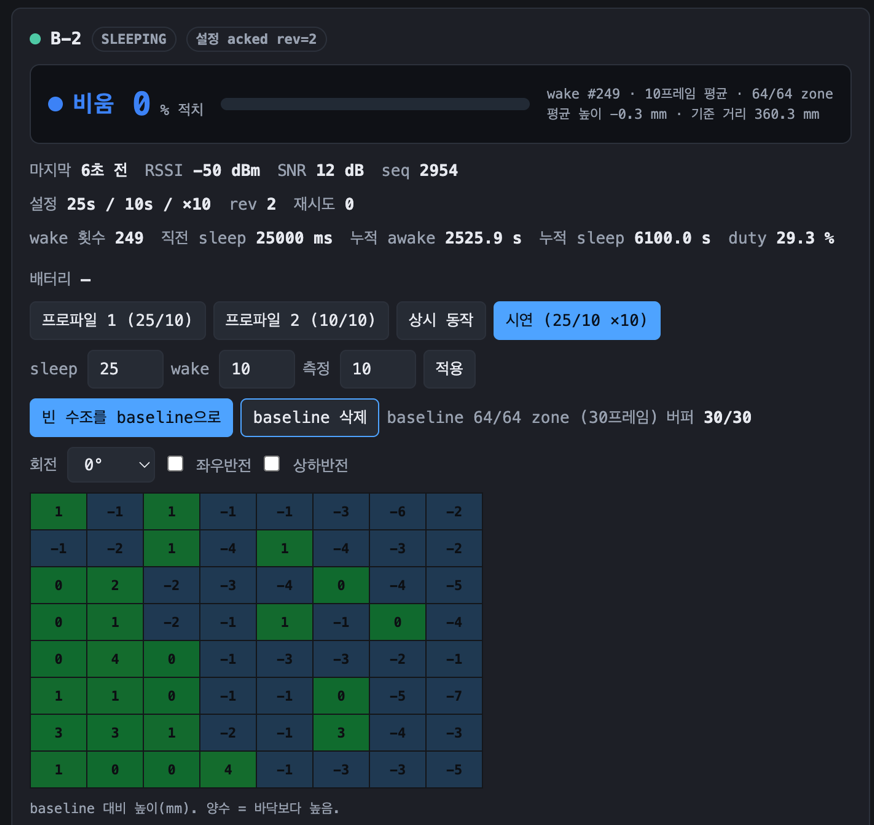
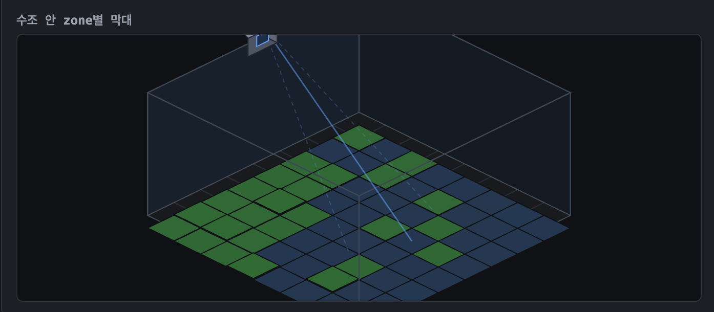
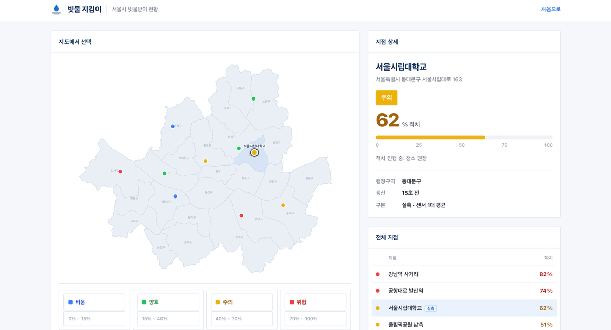
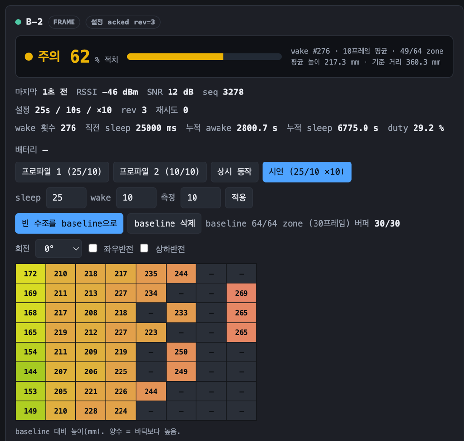
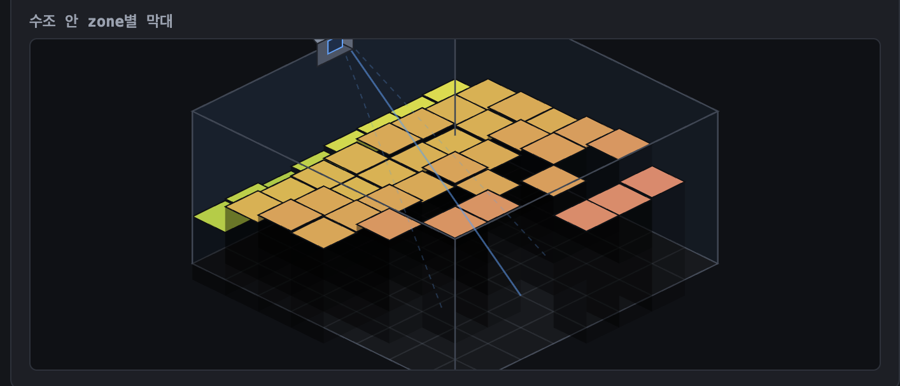

# 빗물 지킴이 — ToF Rainwater Monitor

빗물받이 내부에 쌓인 이물질의 높이를 ToF 센서로 상시 측정하고, LoRa로 전송해
지도 위에 네 단계 상태로 표시하는 시스템입니다.

배터리로 동작하는 측정 노드가 주기적으로 깨어나 8×8 거리 격자를 찍고, 항상 켜져
있는 수신 노드가 이를 받아 Mac의 로컬 웹 UI로 넘깁니다. 설정 변경은 무선으로
내려보내므로 **밀봉한 카트리지를 열지 않고도** 측정 주기를 바꿀 수 있습니다.

```
   Mac 로컬 웹 UI (127.0.0.1)
            │ USB serial
   ┌────────┴────────┐
   │  A: 수신 + 중계  │   상시 USB 전원
   └────────┬────────┘
            │ 양방향 LoRa (point-to-point)
   ┌────────┴────────┐
   │ B-1        B-2  │   ToF + 배터리, 저전력 주기 동작
   └─────────────────┘
```

## 화면

로컬 웹 UI는 세 화면으로 나뉩니다. 아래는 같은 장비로 **빈 수조**와 **물체를 넣은
수조**를 차례로 측정한 실제 화면입니다.

### 첫 화면



---

### 빈 수조 — `비움 0%`

기준면을 잡은 직후의 상태입니다. 64개 zone 전부가 유효하고 평균 높이가 −0.3 mm로,
바닥과의 편차가 1 mm 미만입니다.

사용자 화면은 서울시 25개 구 경계 위에 지점을 표시하고, 점 색이 곧 상태입니다.



관리자 화면은 판정 근거를 그대로 드러냅니다. 몇 번째 wake의 몇 프레임을 평균냈는지,
유효 zone이 몇 개인지가 판정값 옆에 항상 붙습니다.



zone별 높이를 수조 안에 3D로 그립니다. 왼쪽 위 표시가 센서의 위치와 방향입니다.



---

### 물체 적치 — `주의 62%`

같은 수조에 물체를 넣은 뒤입니다. 평균 높이가 217.3 mm로 올라가 `주의` 구간에
들어갔습니다.





유효 zone이 **64개에서 49개로 줄어든 점**에 주목할 만합니다. 물체가 센서에 가까워지면
그 zone은 최소 측정 거리 아래로 들어가 `--`로 빠집니다. 빠진 zone은 평균에서
제외되므로, 가득 찰수록 적치율이 **실제보다 낮게** 나오는 방향으로 편향됩니다.
`n/64 zone` 표시는 그 편향을 읽기 위한 것입니다.



## 상태 판정

측정값은 네 단계로 분류됩니다.

| 등급 | 적치율 | 의미 |
|---|---:|---|
| 비움 | 0% ~ | 바닥이 드러남. 배수 정상 |
| 양호 | 15% ~ | 소량 적치. 배수에 지장 없음 |
| 주의 | 40% ~ | 적치 진행 중. 청소 권장 |
| 위험 | 70% ~ | 배수 불가 임박. 즉시 조치 |

적치율은 **zone마다 자기 baseline으로 나눈 비율의 평균**입니다. 센서가 비스듬히
달려 있어 같은 평면이라도 가까운 열과 먼 열의 거리가 100 mm 이상 차이나는데,
같은 광선 위에서 잰 두 값의 비율을 쓰면 이 기울기가 정확히 상쇄됩니다.
100%는 이물질이 센서에 닿은 상태를 뜻합니다.

자세한 근거와 검증 결과는 [SPEC.md](SPEC.md)에 있습니다.

## 하드웨어

| 장치 | 역할 | 전원 |
|---|---|---|
| A | LoRa 수신기 + 설정 중계 | USB 상시 |
| B-1, B-2 | ToF 측정 + LoRa 송신 | 1S Li-Po |

- 보드: Heltec WiFi LoRa 32 V3 (ESP32-S3 + SX1262)
- 센서: Pololu #3419 (VL53L8CX 8×8 ToF)

## 빌드

### 1. 외부 의존성 내려받기

SX1262 드라이버는 이 저장소에 포함되어 있지 않습니다. 아래 위치에 직접
clone해야 합니다.

```sh
mkdir -p external
git clone https://github.com/nopnop2002/esp-idf-sx126x.git external/esp-idf-sx126x
```

`CMakeLists.txt`가 `external/esp-idf-sx126x/components/ra01s` 하나만 참조합니다.
검증에 사용한 커밋은 `f5e0e7a`이며, 라이선스는 MIT입니다.

VL53L8CX 드라이버는 ESP-IDF 컴포넌트 매니저가 `dependencies.lock`을 보고 처음
빌드할 때 자동으로 받아옵니다.

### 2. 역할별 빌드

빌드 디렉터리와 `APP_NODE_ROLE`로 역할을 고릅니다.

```sh
. $IDF_PATH/export.sh
idf.py set-target esp32s3

# A: 수신 + 중계
idf.py -B build_a -D APP_NODE_ROLE=receiver -D APP_NODE_ID=1 build

# B-2: 저전력 측정 노드
idf.py -B build_b2 -D APP_NODE_ROLE=sender -D APP_NODE_ID=2 build
```

`APP_NODE_ROLE`은 `diagnostic`, `sender`, `receiver`, `i2cdiag` 중 하나입니다.

> **플래시 전에 반드시 MAC으로 대상을 확인하세요.** 세 보드의 USB-serial 칩이
> 같은 문자열을 보고하기 때문에 macOS는 포트 이름을 꽂은 순서대로 배정합니다.
> 포트 이름만 믿으면 엉뚱한 보드에 씁니다.
>
> ```sh
> python -m esptool -p /dev/cu.usbserial-0001 read_mac
> idf.py -B build_a -p /dev/cu.usbserial-0001 -b 115200 flash
> ```

## 웹 UI 실행

표준 라이브러리와 PySerial만 씁니다. 웹 프레임워크를 쓰지 않고, 페이지도 외부
리소스를 전혀 받지 않으므로 오프라인에서 동작합니다.

```sh
python3 tools/ui/server.py --port /dev/cu.usbserial-0001
# http://127.0.0.1:8765
```

### 강우 연동 (선택)

기상청 초단기실황을 5분마다 조회해, 비가 오면 짧은 주기로 자동 전환합니다.
[공공데이터포털](https://www.data.go.kr)에서 *기상청_단기예보 조회서비스* 인증키를
받아 넘기면 됩니다.

```sh
export KMA_SERVICE_KEY='발급받은_인증키'
python3 tools/ui/server.py --port /dev/cu.usbserial-0001
```

| 상황 | 시연값 | 현장 운용값 |
|---|---|---|
| 비강우 | 30초 sleep / 10초 wake / 10회 측정 | 3시간 |
| 강우 | 20초 sleep / 10초 wake / 10회 측정 | 20분 |

강우 상태가 바뀔 때만 `CFG`를 보내므로 손으로 설정한 값이 계속 덮이지 않습니다.
관리자 화면에서 자동 전환을 끄거나 프로파일을 직접 적용할 수 있습니다.
키를 주지 않으면 이 기능만 꺼진 채로 나머지는 그대로 동작합니다.

| 경로 | 화면 |
|---|---|
| `/` | 첫 화면 |
| `/user` | 서울시 지도 |
| `/admin` | 실시간 모니터 |
| `/survey` | 한 센서를 두 위치로 옮기며 스캔 |

시리얼 포트는 한 프로그램만 잡을 수 있으므로 `idf.py monitor`를 먼저 닫아야
합니다.

## 호스트 테스트

프로토콜 인코딩과 기하 계산은 보드 없이 검증합니다.

```sh
cmake -S test/host -B build_host
cmake --build build_host
ctest --test-dir build_host --output-on-failure
```

## 문서

| 문서 | 내용 |
|---|---|
| [SPEC.md](SPEC.md) | 하드웨어 기준, 프로토콜, 실측 결과, 시행착오 기록 |
| [docs/ARCHITECTURE.md](docs/ARCHITECTURE.md) | 컴포넌트 구조와 실행 흐름 |

## 특허

**출원 보류 중입니다.** 진행 상황이 정해지면 이 절에 출원 번호와 범위를
적을 예정입니다.

## 라이선스

<!-- 라이선스를 정하면 여기에 적고 LICENSE 파일을 추가합니다. -->

정해지지 않았습니다. 별도 표기 전까지 이 저장소의 코드에 대한 권리는 저자에게
있습니다.

외부 구성요소는 각자의 라이선스를 따릅니다.

- [nopnop2002/esp-idf-sx126x](https://github.com/nopnop2002/esp-idf-sx126x) — MIT
- VL53L8CX ULD 드라이버 — STMicroelectronics
- 서울시 행정구역 경계 — 통계청 2013년 자료, [southkorea/seoul-maps](https://github.com/southkorea/seoul-maps)
